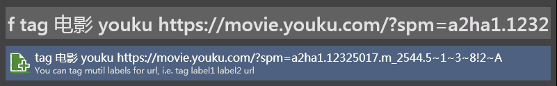
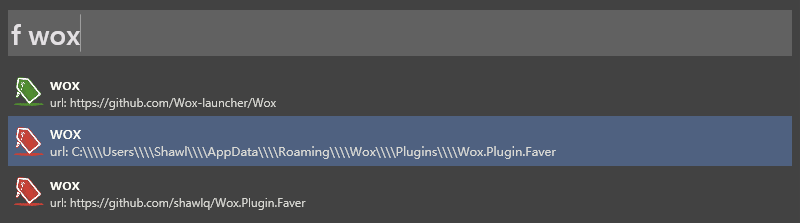

[TOC]

# What's Wox
**Alfred**是**Mac**平台上无可争议的效率启动神器，他是增强版的Spotlight，除了快速执行启动应用、计算公式、搜索一切之外，还有强大的可扩展性，拥有众多的功能扩展插件。
少数派此前已对**Alfred**做过多篇文章介绍，[**点此阅读**](https://sspai.com/tag/alfred)。

在 Windows 上也有类似的效率软件，名叫 Wox，它拥有和 Alfred 相同的使用方式和逻辑。

# What's Faver
**Faver**是一款支持多标签检索网址的**Wox**插件。
出于解决自身工作上的一些不爽：
- 公司某个溯源网站，长时间不用，忘了放哪了
- 涉及CI相关的网站太多，点开收藏夹仍然要找半天
- 不喜欢收藏夹的层级目录设计，喜欢**Mac**的应用级设计，不关心路径，所见所得
- 用鼠标找东西不符合程序员的气质

### **Faver**功能
- 支持对1个url添加多个label
- 支持删除label
- 支持多label快速索引到网址
- 支持模糊匹配label

### 快速使用
1. **快捷键** alt+space（可自定义）
1. **输入**
- 关键字：f tag
- 2个label：电影 youku
- url：https://movie.youku.com/?spm=a2ha1.12325017.m_2544.5~1~3~8!2~A
1. **回车**确认！

**是的！它支持中文！**

当你需要时
1. **alt+space**
1. **f 电影**
1. **回车**

或者
1. **alt+space**
1. **f youku**
1. **回车**

我常用**Faver**快速打开我的github

可以使用多**label**精确定位，并且它支持**模糊匹配**

# 如何安装
## 1. 通过**Wox**插件管理安装，请参考[**Wox官网**](http://www.wox.one)。
## 2. 离线安装：
- 下载**Faver**仓库：git@github.com:shawlq/Wox.Plugin.Faver.git
- 把代码目录Wox.Plugin.Faver拷贝到Wox的插件目录，例如C:\Users\Shawl\AppData\Local\Wox\app-1.3.578\Plugins，如果找不到路径，就用**Wox**搜索
- 重启**Wox**。

